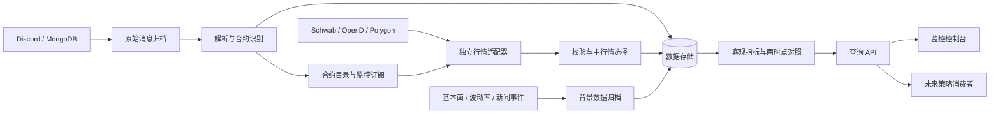

# Option Desk 基础设施详细设计

- 版本：v0.10
- 日期：2026-09-28
- 状态：设计草案，待评审；不代表数据源已联通或功能已实现
- 范围：美股期权数据监控与审计基础设施
- 初始假设：单用户使用、单机部署起步，保留服务化部署能力
- 运行约定：Option Desk 正式运行时用户会停掉 midas，不设计两项目并行运行的预算或凭据协调机制

## 1. 目标与需求依据

Option Desk 负责把来源消息、精确期权合约、市场行情和背景数据可靠地关联起来，提供可追溯的“单子发生时与当前”对照数据和查询接口。

策略消费者可以读取这些数据，自行决定筛选、评分和交易行为。本项目不承担策略判断。

需求依据：

1. 用户明确要求：建设 option 监控台，只做基建，不做策略；数据获取可借鉴 midas，字段参考附件。
2. 附件《Option Desk 字段级数据源说明》（适用版本：生产 r18），作为字段及来源参考。
3. 本地 midas 接入代码的只读检查，作为实现参考。
4. 用户后续明确：每笔单子只需要发生时和当前两份快照，不保存每次查询或刷新产生的行情历史。
5. 单子通常延迟被发现：发生时基准采用来源字段优先、事件所在分钟的 1 分钟 K 线收盘价估算，不要求精确逐笔复原；不提供手工重抓。

附件包含其他系统的策略、生产状态和准入规则。这些是参考材料中的描述，不自动成为本项目需求。附件中的生产覆盖率、来源可用性和部署状态，也不代表本项目已验证的能力。

本设计阶段只进行了文件和代码阅读，没有调用真实行情、消息或账户接口，也没有验证凭据与行情订阅权限。

## 2. 范围与边界

| 附件内容 | 本项目处理 |
|---|---|
| Discord、MongoDB 消息及合约解析 | 采集、归档、解析，保留原文和依据 |
| Schwab / OpenD / Polygon 精确合约与行情 | 独立适配、校验、主来源选择与降级 |
| IV、Greeks、OI、成交量、基本面、事件 | 保存数值、来源、口径和时间 |
| Spread、Volume/OI、PCR、IV 差等 | 客观计算，不输出投资结论 |
| Mentions、Source count | 去重后的事实统计，不转成分数 |
| 来源 bullish/bearish、ask/bid | 原样保存；推断另设字段 |
| Alert Rank、Quality Score、Handler 权重 | 不实现 |
| 市值 $2B、股价 $10、premium $1M 等门槛 | 不作为采集或展示过滤规则 |
| Meme、行业龙头 | 可保存外部标签，不自行分类、不据此排除 |
| 推荐、overnight hint、48h 重新激活 | 不实现 |
| 入场、退出、收益评估、Top 20 名单 | 不实现 |
| 收盘快照、连续行情历史 | 不实现；只保留发生时与当前两个状态 |

通常数据缺失意味着字段或计算不可用，不意味着整条记录禁止展示。例外：按用户要求，非交易时段事件回查最近一个已结束交易日仍找不到有效期权分钟 K 线时，丢弃该监控事件，仅保留原始来源和诊断原因。这是数据接入规则，不是投资准入规则。

项目不提供下单、撤单、持仓管理或策略执行接口。未来策略输出如需展示，必须使用独立数据对象，不能覆盖原始事实。

## 3. 设计原则

1. 原始事件先归档，再解析和计算。
2. 合约身份、行情时效、字段完整性分开判断。
3. 当前主行情包不跨提供商拼接字段；发生时基准允许来源事实与单一历史行情提供商的分钟估值组合，逐字段标明出处与估算方法，不能伪装成完整实时行情包。
4. 缺失使用 null 和原因，不转换成零。
5. 发生时间、有效时间、接收时间和计算时间分别保存。
6. 发生时指标与输入一起冻结；当前指标与当前输入一起覆盖，不承诺重现已覆盖的中间状态。
7. 采集与查询解耦，查询接口不临时触发大规模外部请求。
8. 重启后可恢复，重复任务不重复增加逻辑记录。
9. 接入能力以真实样本和权限核验为准。
10. 页面查询不写快照；行情刷新只覆盖当前状态，不追加历史。

## 4. 系统架构

一个代码仓库，三个运行组件：采集 Worker、查询 API、Web 控制台。初期不拆微服务。

### 4.1 数据分层

| 层级 | 职责 |
|---|---|
| 原始层 | 归档来源消息及修订；行情报文只随发生时包或当前包保存，不逐次归档 |
| 标准层 | 统一字段、单位、合约身份、时间和状态 |
| 计算层 | 根据明确输入生成可复现的客观指标 |
| 展示层 | 查询、筛选和呈现数据，不改写底层事实 |

### 4.2 初始技术选型

| 组件 | 建议选型 | 用途 |
|---|---|---|
| 后端与采集 | Python | 借鉴 midas 数据接入，执行解析与计算 |
| 查询接口 | FastAPI | 提供版本化 API |
| 存储 | PostgreSQL | 标准数据、快照、任务和运行状态 |
| 前端 | React + TypeScript | 监控表、详情和诊断页面 |
| 界面更新 | SSE | 服务端推送数据更新通知 |
| 持久任务 | 数据库任务表 + 独立 Worker | 调度、重试、消息补采和恢复 |

初期不引入 Kafka，也不强制引入 Redis。外部 MongoDB 是只读来源，本项目数据库独立。

PostgreSQL 结构化列用于身份、时间和常用查询；JSONB 用于有约束的来源扩展字段。需要字节级保真的原始报文另存文本或文件，不能只保存在 JSONB 中。

## 5. midas 参考与复用边界

参考代码位于本地 `/Users/turtle/Code/midas`。这些路径是设计依据，不应成为未来部署时的运行依赖。

| 参考文件 | 可借鉴内容 | 必须调整 |
|---|---|---|
| `src/midas/option_flow_sources.py` | Discord 历史分页、Embed 提取、MongoDB tweets 读取、限流重试 | 完整原始报文、持久游标、修订版本、来源血缘 |
| `src/midas/schwab_adapter.py` | 认证、报价、期权链、请求重试 | 只提取行情能力；明确凭据刷新及限流归属 |
| `src/midas/option_flow_validation.py` | 指定到期日与行权价查询、OpenD quote-first、代码映射 | 拆开身份匹配、行情新鲜度和字段有效性 |
| `src/midas/options.py` | 期权链展开、行情字段映射 | 缺失不填零；统一 IV、比例和 Greeks 单位 |

已观察到的差异：

- 部分 Schwab 合约缓存读取只检查文件是否存在，没有在读取处检查 TTL，不能直接作为本项目实时缓存。
- 部分期权链字段通过辅助函数把缺失值转换为零，会混淆缺失与真实零值。
- 现有流程包含策略阶段和候选筛选，不应整体迁移。

复用方式是提取接入思路和适用代码，形成独立适配器，不依赖 midas 的策略流程或报告文件。

## 6. 数据源与能力核验

| 数据类别 | 计划来源 | 当前设计依据与待核验项 |
|---|---|---|
| Discord 消息 | 配置频道、Twitter relay、Embed | midas 有读取代码；本项目权限和频道映射待核验 |
| X / tweets | MongoDB tweets | midas 有读取代码；作者和时间字段语义待核验 |
| 期权流 | MongoDB option feed、targeted feed | 附件列出；集合、结构、更新方式待核验 |
| 合约及行情 | Schwab → OpenD → Polygon | 前两者有参考代码；全部仍需本项目联调 |
| 基本面 | Schwab、Barchart | 字段覆盖、资产类型、AUM、权限待核验 |
| 波动率背景 | OpenD、Barchart、OptionCharts | IV/HV 定义、期限、窗口、更新时间待核验 |
| 新闻事件 | MongoDB analyst/catalyst/event feed | 集合、事件时间、修订和覆盖待核验 |
| 其他备用 | Finnhub 等 | 不作为首版已承诺能力 |

每个适配器维护能力矩阵：支持字段、原始单位、更新时间语义、实时或延迟权限、请求上限、历史能力、缺失表示和已验证样本。

来源不支持某字段时返回 `unsupported`，不能通过其他字段或未经声明的估算伪装成支持。

## 7. 核心数据模型

| 对象 | 核心内容 | 约束 |
|---|---|---|
| `raw_events` | 来源、外部 ID、版本、原文、来源时间、接收时间、hash | 追加保存修订，不覆盖历史 |
| `observations` | 原始事件引用、逻辑事件引用、作者、合约线索、premium、side、方向、标签、解析版本 | 一个来源消息可解析为多个观察；观察是来源证据，不是去重后的单子 |
| `logical_events` | 去重后的期权事件 ID、关联观察与身份依据 | 同一单子的重复转发关联到同一逻辑事件；合约集合由基准关联派生，不单独存储 |
| `instruments` | 标的、期权根代码、到期日、行权价、C/P、乘数、交割信息 | 独立内部 ID；身份精确 |
| `provider_symbols` | 合约 ID、provider、原生代码、验证时间、映射版本 | 保留映射变更历史 |
| `event_baselines` | baseline_id、logical_event_id、instrument_id、状态、基准包及证据 | 主键 baseline_id；唯一约束 `(logical_event_id, instrument_id)`；完成后冻结 |
| `current_states` | 合约、选中 provider 的行情包、背景、指标、更新时间、状态及版本 | 每个合约一份当前状态，原子覆盖；多笔单子共享 |
| `context_cache` | 最新链数据、基本面、波动率背景及有效时间 | 按键覆盖；基准所需输入复制入基准，不引用可变缓存 |
| `watchlists` | 监控对象、添加来源、刷新档位、保留期限 | 资源配置，不是策略名单 |
| `collector_state` | 游标、最后成功时间、错误、覆盖水位 | 与落库结果协调提交 |
| `jobs` | 任务类型、状态、租约、重试次数、错误 | 支持幂等和崩溃恢复 |
| 当前状态中的来源选择信息 | 当前 provider、上次 provider、最近切换时间及原因 | 不额外保存切换行情快照 |

字段血缘需支持：来源 → 原始记录 → 原始字段 → 转换方法 → 标准值。

### 7.1 事件身份与基准定位

- `raw_event_id` 标识来源消息或其修订记录；`observation_id` 标识从来源解析出的证据，多个观察可描述同一笔单子。
- `logical_event_id` 标识去重后的单子。一笔逻辑事件可以关联多个合约，同一合约也可以出现在多笔不同事件中。
- 每个 `(logical_event_id, instrument_id)` 唯一对应一个 `baseline_id`。识别出该组合后即创建状态记录，pending/unavailable/discarded 可只有状态与原因，不要求存在完整行情包。
- 重复转发只追加证据关联，不创建重复基准；当前状态仍按 `instrument_id` 共享。
- 来源列表和监控列表返回合约级 `baseline_id`，多合约事件从 `event_baselines` 按 logical_event_id 派生合约条目数组，不另存合约集合，不用 observation_id 隐式选择基准。正常监控仅返回适用于最新修订的基准；诊断查询可返回失效关联。

### 7.2 缺失和错误

标准字段使用 `null` 加原因，至少区分：

- `not_provided`：来源本次未提供。
- `unsupported`：来源没有该能力。
- `permission_denied`：权限不足。
- `stale`：超过时效要求。
- `invalid`：值或格式非法。
- `conflict`：多个证据冲突。
- `fetch_failed`：获取失败。

最后成功值可以保留展示，但必须携带原始时间和 stale 状态，不能在刷新失败后改写成新数据。

## 8. 附件字段映射

| 字段组 | 字段与落点 | 处理说明 |
|---|---|---|
| 来源合约 | Ticker、Strike、Call/Put、Expiration → observations / instruments | 原始解析结果与确认后的身份分开 |
| 来源事实 | direction、timestamp、premium、trade side、author、narrative tags → observations | 声明值与推断值分开 |
| 来源统计 | Mentions、Source count → 两时点包内指标 | 明确时间窗口及去重口径 |
| 精确行情 | Bid、Ask、Last、Mark、volume、OI、IV、Delta、Gamma、Theta、Vega、spot、quote time → event_baselines / current_states | 单一 provider 行情包 |
| 原生代码 | OCC / OpenD / Polygon code → provider_symbols | 原生代码不替代内部身份 |
| 衍生行情 | spread、Volume/OI、ITM/OTM、距离、名义金额估值 → 两时点包内指标 | 明确输入、分母和乘数 |
| 链级背景 | 同到期平均 IV、IV 相对均值、Volume PCR、OI PCR → 两时点包内链级指标与输入 | 显式记录链范围和覆盖 |
| 波动率 | IV 30-day average、HV30、IV Rank、Percentile、underlying IV、IV-HV、IV trend → 两时点包内背景与指标 | 保留定义与期限，不替代合约 IV |
| 基本面 | asset type、market cap、managed assets、时间、行业龙头/meme 标签 → 来源事件 / 两时点包内背景 | 股票市值与基金资产规模分开 |
| 新闻事件 | analyst catalyst、earnings、news → 来源事件 / 两时点包内背景 | 保存事件、发布时间和修订 |
| 窗口字段 | spot、IV、day high/low → 发生时与当前包 | 不额外创建入场或收盘快照 |
| 两点变化 | IV、spot、OI 等发生时与当前差值 → 对照结果 | 仅比较可比数据，不提供中间路径 |
| 策略输出 | Flow direction 综合判断、PCR alignment、rank、outcome、overnight hint | 不实现；来源明确声明可作为原始观察保存 |

## 9. 消息处理与合约身份

### 9.1 处理流程

1. 保存原始事件和获取元数据。
2. 优先解析结构化字段和 Embed，再解析文本。
3. 为每个字段保存证据、解析方法与版本。
4. 完整合约信息进入 provider 精确匹配。
5. 不完整、冲突或歧义记录进入待核验视图，仍可查询原文。

不能为凑齐字段默认猜测到期年份，不能把接收时间伪装成来源事件时间。缺少时间的事件可归档，但不进入要求事件时间的统计。

### 9.2 合约身份

普通合约通过标的、到期日、行权价和 Call/Put 识别，内部统一使用 `instrument_id`。

额外保存期权根代码、乘数、交割信息、非标准标记及可获得的行权/结算属性。调整合约不能与普通合约错误合并。不确定的非标准合约标为待核验，不通过推算代码直接确认身份。

行权价使用精确小数，不依赖浮点字符串拼接。提供商返回代码需与返回元数据一起验证。

### 9.3 去重与修订

采用证据驱动的确定性身份规则，不用相似度或时间窗口直接决定合并：

| 证据 | 身份处理 |
|---|---|
| 相同来源命名空间、外部消息 ID、修订版本 | 同一原始记录，幂等读取 |
| 相同权威成交/事件 ID，命名空间与粒度一致 | 关联同一 logical_event_id，保留各自来源证据 |
| Discord 与 MongoDB 明确指向同一 X 原帖 ID 或可规范化的原帖 URL | 对应原帖中的同一事件关联同一 logical_event_id |
| 明确原始消息引用或转发链 | 追溯原始事件标识后关联，不以转发时间创建新事件 |
| 只有同作者、同合约、相近时间、相同金额或相似文本 | 不自动合并；分别保留，仅标记 suspected_duplicate |
| 具有不同独立成交 ID 或明确描述另一笔成交 | 新逻辑事件，即使同一分钟、同一合约也不合并 |

原帖可以包含多笔独立单子，原帖 ID 本身不意味着只能有一个 logical_event_id。来源适配器需以来源自带子事件 ID 或可验证的稳定事件锚点区分子事件；多腿单的一组腿属于同一事件的多个合约。缺少可靠子事件对应关系时不自动跨记录合并。时间窗口只用于缩小疑似重复检索范围，没有“N 分钟内必合并”的规则。

身份键规范化规则需版本化，记录 namespace、原始标识、子事件锚点、规则版本及证据引用。数据库为确定性身份键建立唯一约束，分配 logical_event_id 时原子创建或取得已有映射，避免并发解析先产生两个逻辑事件。相似记录但无可靠身份键时使用独立身份，不伪造合并证据。

#### 修订边界

- 同一原始消息的修订保留原文新旧版本。能定位到原有子事件时沿用 logical_event_id；明确新增的独立子事件创建新 logical_event_id。
- 修订只改变描述、价格或数量时追加证据与冲突说明，不改写已冻结的基准数值。
- 修订改变 strike、到期日或 C/P 等合约身份时，沿用原子事件的 logical_event_id，将旧合约基准标为 `applicability=invalidated`，保留原包和失效原因。新合约按唯一键定位或创建自己的基准，自动执行首次构建，不能搬用旧合约价格；这不属于手工重抓或同一合约重拍。
- `applicability` 与构建状态分开：构建状态仍为 pending/ready/unavailable/discarded，失效关联不参与监控与差值计算。正在构建的旧合约任务停止，提交前检查关联适用性。
- 若新合约已有该事件的基准则复用现有记录，不重复构建；恢复先前关联只恢复适用性，不重抓或改写冻结包。无法可靠对应修订前后子事件时保留歧义诊断，不强制合并。

统计同时提供 `mention_count`（窗口内独立消息数）和 `independent_source_count`（能确认的独立原始来源数）。来源关系不明时标记不确定，不假装已经完成独立性确认。重复转发只追加观察关联，不增加同一事件合约的基准。

## 10. 行情选择与降级

默认顺序为 Schwab → OpenD → Polygon，配置化管理。各家响应独立评估，仅将选中的完整行情包写入当前状态；未选中的响应不长期归档。

### 10.1 状态维度

| 维度 | 状态示例 |
|---|---|
| 身份 | matched / ambiguous / not_found / unsupported |
| 时效 | fresh / delayed / stale / market_closed / unknown |
| 能力 | has_two_sided_quote / has_valid_iv / has_greeks / has_oi |

默认选择身份匹配、时间可验证且新鲜的行情包。在这些包中，若存在有效 IV 的包，优先按提供商顺序选择这类包；若全部缺 IV，可选择基础行情包并明确 IV 不可用。

这是数据服务选择规则，不是推荐准入。没有合格实时包时，允许展示最后成功快照或延迟快照，但必须标明状态，不能声明实时有效。

### 10.2 不混源约束

- 不用 OpenD 的 OI 填补 Schwab 主行情的 OI。
- 切换时覆盖当前包，记录最近切换的原因、时间及 provider 名称，不保留旧行情包。
- 对照逐字段检查来源、单位与方法。行情 provider 不同时返回 `provider_mismatch`；来源值/分钟估值/模型值与当前值的差异只能标为“估算变化”，不得称精确收益。方法不兼容时差值为空，两边原值仍正常显示。
- 同一提供商内通过多个请求组成行情包时，也必须保留各字段时间及允许的时间偏差；同源不等于同时。
- 背景数据允许独立来源，但必须放在独立对象中。

合约匹配只证明身份对应，不证明当下可以实际成交。界面不使用“已验证可交易”作为匹配状态。

### 10.3 字段可比性矩阵

对照接口统一执行规则，前端只显示结果，不自行决定能否相减。首先要求同一合约、相同字段语义与单位、有效输入和可解释的时间口径；不同 provider、模型口径未知、基准已失效或任一值缺失时默认不计算差值，保留两边原值和原因。来源值只有记录了提供商或计算口径才能通过相应检查。

| 基准值与当前值组合 | 输出 |
|---|---|
| 同源、同口径的两个直接观测值 | 数值变化；不称精确交易收益 |
| 分钟 close 估值与可比的当前价格（last/mark/mid 等明确标记） | 估算变化，列明两边价格类型 |
| 来源报告成交价与当前价格 | 适配器的结构化口径通过规则校验后可显示估算变化；否则不可比 |
| 模型估值与同模型、同参数约定的值 | 估算变化 |
| 模型 IV/Greeks 与模型未知的提供商值 | 不可比；仅并排展示 |
| 两个不同或未知口径的来源值 | 不可比；仅并排展示 |
| 最近交易日代理与兼容的当前值 | 代理基准的估算变化；显示实际代理日期，不声称真实事件时点变化 |
| 缺失、无效或单位无法统一 | 不可比，并返回具体原因 |

“口径通过规则校验”由后端依据适配器/解析器输出的 `price_type`、`unit`、`currency`、`provider`（若已知）、`method_id`、`method_version`、有效时间、`provenance_ref` 与 `normalization_rule_id` 判定。字段按适用性要求，未知信息明确为空；不得根据人工备注或自由文本“已解释”直接放行。来源报告成交价与当前估值属于显式允许的估算对照规则，不能借此放行未知模型的 IV/Greeks 比较。响应携带命中的 `comparison_rule_id` 和拒绝原因。

`value_origin` 仅为判断输入之一；不能只凭标签组合决定可比性。接口每个字段返回 `comparison_status`、`delta`（可为空）、`reason` 与时间/来源/方法标签。百分比变化分母为零时为空；IV 等指标优先明确展示百分点差。

## 11. 时间、单位与对照语义

### 11.1 时间字段

| 字段 | 含义 |
|---|---|
| `event_time` | 来源事件实际发生时间 |
| `quote_time` | 提供商报价时间 |
| `trade_time` | 最近成交时间 |
| `received_at` | 本系统收到数据的时间 |
| `as_of` | 字段代表的有效时点或交易日 |
| `computed_at` | 本系统计算时间 |

统一 UTC 存储。市场时段和交易日依据对应交易所日历，不能只用本地日期或固定收盘时间。界面支持美东与北京时间。

当天抓取不等于当日报价，当日报价不等于新鲜报价。OI 的有效日期独立保存，来源未提供时保持未知。

来源消息保留发生与接收时间；发生时基准保留来源字段时间、历史分钟起止时间与获取时间。不提供任意历史时点行情查询，也不承诺恢复已经覆盖的当前状态。

### 11.2 单位

| 类别 | 约定 |
|---|---|
| IV、HV、比例 | 内部小数，展示百分比，保留原始值和单位 |
| 金额、价格、行权价 | 精确小数与币种 |
| volume、OI | 合约张数，缺失不填零 |
| Greeks | 保留原始口径，确认单位后再标准化 |
| premium | 来源报告值与估值分开 |
| 乘数 | 读取合约元数据，不一律使用 100 |

基本面区分股票 market cap 与 ETF/Fund managed assets。资产类型未知或来源冲突时标记状态，不禁止其他数据展示。

## 12. 客观指标规范

| 指标 | 计算要求 |
|---|---|
| Mid | 同一包 bid/ask 合法时计算 `(bid+ask)/2` |
| Spread ratio | `(ask-bid)/mid`；mid > 0；倒挂报价不作为有效常规 spread |
| Volume/OI | 同源、OI > 0，显示 OI 有效日期 |
| ITM/ATM/OTM | 结合 C/P、strike 和 spot 判断 |
| 距离 | 分开保存带符号距离和绝对距离；不能用绝对距离判断 OTM |
| 名义金额估值 | 明确价格类型 × volume × multiplier；不等于实际成交 premium |
| 同到期平均 IV | 同源、同到期、同方向，明确样本过滤与加权方式 |
| IV 相对链均值 | 合约与链口径一致，标记时间差和样本数 |
| Volume / OI PCR | 明确到期范围、分母和完整性，部分链不能称全链 |
| IV-HV | 展示各自期限、时间；不匹配时标记不可直接比较 |
| IV Rank / Percentile | 读取外部提供的背景值并保留定义；不为本地计算额外建立历史行情库 |
| IV 变化 | 只计算可比的基准与当前差值，不把两点变化称为持续趋势 |
| OI change | 基准与当前需为相同合约、同源且有效日期可比较；前值为零时不计算百分比 |

成交方向推断延后实现。只有取得成交时点附近的历史 bid/ask，才考虑辅助推断。不能用当前报价解释过去成交，也不能据此证明开仓或平仓。

链覆盖不完整、单位未知或输入过期时，指标返回不可用或明确的部分覆盖状态，不静默输出看似完整的数值。

## 13. 采集与调度

以下为初始调度建议，不是性能承诺。正式频率由权限、配额、市场时段和压测确定。

| 类型 | 建议频率 |
|---|---|
| 来源增量读取 | 30–60 秒，包含重叠窗口 |
| 重点监控合约 | 15–30 秒 |
| 普通监控合约 | 60–120 秒 |
| 期权链背景 | 5–15 分钟 |
| 基本面 | 30 天缓存，事件可触发提前刷新 |
| 波动率背景 | 按来源实际更新周期 |
| OI | 按来源更新周期检查 |
| 发生时基准 | 新逻辑事件识别后回查对应分钟；等待分钟结束及来源数据就绪，有限自动重试，完成后冻结 |

初期采集范围：人工关注列表，以及配置来源识别出的合约。设置订阅与请求资源上限，超出时进入可见等待列表，不按投资分数筛选。

### 13.1 恢复与限流

- 至少执行一次，配合幂等写入。
- 数据落库成功后推进游标；分页中断保留进度和覆盖缺口。
- 增量读取有重叠窗口；修订扫描需依据来源能力单独安排。
- 任务使用租约和超时恢复，避免进程崩溃后永久卡住。
- 实时任务优先于来源历史消息补采，所有任务共享 provider 请求预算。
- 限流按提供商响应退避，连接错误指数退避并加入抖动。
- 认证失败与普通网络失败分开处理，避免无效持续重试。
- 不可解析事件进入诊断列表，可在解析器升级后重新处理。

### 13.2 并发创建与任务认领

创建基准使用 `INSERT ... ON CONFLICT (logical_event_id, instrument_id) DO NOTHING` 或等价原子操作，随后读取唯一记录。唯一冲突是正常幂等路径，不报错中断，也不意味着可以再次采集。

只有持有该基准构建任务有效租约的 worker 才可向上游请求。任务键按 baseline_id 唯一；通过原子条件更新认领，完成/失败写入验证租约令牌和关联适用性。租约过期可由其他 worker 接管，旧 worker 的迟到结果不能覆盖新结果。ready/unavailable/discarded 等已结束记录不重新领取首次构建任务，遵守“不手工重抓、不重复重拍”。

### 13.3 独立请求预算

所有外部采集请求经过 Option Desk 内部统一调度器。按 provider 及其实际限额维度配置请求速率、并发、订阅数和适用的费用上限；具体值在阶段 0 核验，不预设未经验证的额度。不为 midas 预留配额，不建设跨项目预算协调服务。

- 当前行情按合约合并请求，多笔事件共享一次刷新；可批量的接口优先批量调用。
- 历史分钟查询按 provider、合约和分钟去重，短期缓存复用，不新增持久行情历史。
- 基本面和背景数据使用缓存；备用 provider 按失败或必要能力缺失触发，不默认全部并行拉取。
- 来源增量与当前行情预留预算，新事件基准使用独立份额，背景刷新与消息补采使用剩余份额；各预算窗口先保障实时与基准队列的预留份额，再释放未使用份额供低优先级任务借用。借用不得预占下一窗口，下一窗口重新分配；当窗口预留已释放后到达的任务进入剩余额度或下一窗口，显示实际排队时间。
- 同一合约的刷新需求取最高档位，再受 provider 总预算约束；界面展示实际更新时间和排队状态。
- 发出请求前预占预算，失败与重试同样计入；按端点实际计费或限额单位核算，不假定一个批量调用总是只消耗一个额度。
- 额度不足时排队或降低刷新频率，不丢事件、不将旧数据标成实时。手动刷新当前状态也经同一调度器并合并重复请求。
- 限流遵循提供商要求等待；连续失败时熔断，并以低频请求探测恢复。

## 14. 两份快照的存储规则

每笔单子仅有两个逻辑状态：冻结的发生时基准，以及持续覆盖的当前状态。不保存定时采样、收盘快照、provider 切换快照或每次查询/刷新历史。

### 14.1 单子的定义与共享

“单子”指来源中识别并去重后的期权事件，不是本系统交易订单。一个事件包含多个合约时，每个事件合约分别建立基准。

- 同一事件的重复转发关联同一个基准。
- 同一合约在不同时间出现的新事件各有自己的基准。
- 相同合约的多笔事件共用一份当前状态，不重复请求或保存当前行情。
- 人工关注但尚无来源事件的合约只有当前状态，不伪造发生时基准。

因此，存储规模约为“事件合约数份基准 + 监控合约数份当前状态”，不随刷新次数增长。

### 14.2 发生时基准：来源优先与分钟估算

单子通常在发生后才被发现，不要求捕获逐笔报价或精确还原成交瞬间。基准先使用 source 明确提供且能对应本事件的字段，缺失部分再依据精确期权合约在事件所在分钟的 1 分钟 K 线进行估算。

这里的历史查询对象首先是精确期权合约；需要标的价格时，另外查询同一历史提供商的标的同分钟 K 线。仅有标的 K 线不能核验期权单子。历史适配器按配置顺序选择具备权限和覆盖的单一提供商，不把不同历史提供商的数据拼成一个行情包。

#### 非交易时段的回查规则

- 优先使用来源明确给出的真实成交时间。如果晚间消息明确转发盘中成交，仍查该成交分钟，不按消息发布时间切换交易日。
- 用于定位的事件时间落在该合约非交易时段时，回查该时间之前最近一个已结束交易日的精确期权合约 1 分钟 K 线。盘后包括刚结束的当日，盘前/周末/假日按对应市场日历定位；不固定减一个自然日，也不锚定本系统查询日。
- 最近交易日内有来源明确指出的成交分钟时优先定位该分钟；没有具体分钟时，设计默认取该交易日最后一根有效、非前值填充且有成交的分钟 bar，用 close 作为估值。记录 `baseline_time_basis=previous_session_proxy`、实际 bar 时间与回查交易日，不声明找到了真实大单成交分钟。
- 需要标的估值时仍取所选期权 bar 同分钟的标的价格；其他缺失字段遵循既有估算规则。
- 若最近一个交易日没有有效期权分钟 K 线，按配置备用源及有限自动重试完成检查后，标记 `discarded`、原因 `no_valid_bar_in_latest_session`，不进入监控表、不为该事件创建持续刷新任务。source 提供的价格不绕过这一要求。
- 不继续向更早交易日寻找数据。网络或权限错误先记为待处理，有限重试耗尽仍无法取得数据时同样退出监控，但原因应区分 `history_fetch_failed`，不能误称无成交。
- “丢弃”是退出监控对象，不删除原始来源和诊断记录；不会移除同一合约的其他有效事件或人工关注。
- 缺少可解释的定位时间时保持时间缺失诊断，不擅自用本系统接收时间套用最近交易日规则。

#### 字段取值

| 字段 | 基准取值规则 |
|---|---|
| 期权价格 | 来源报告成交价优先；缺失时使用期权所在分钟 close，标记 `minute_close_estimate` |
| 标的价格 | 来源事件对应价格优先；缺失时使用标的同分钟 close，记录其独立时间和来源 |
| 成交张数 | 只使用来源明确报告的单笔张数；分钟 volume 单独保存，不当成单笔张数 |
| Premium | 来源报告值优先；否则仅在单笔张数及乘数已知时用估算期权价格 × 单笔张数 × 乘数计算，并标记估值 |
| ITM/OTM、距离、名义金额等 | 根据可用价格和合约属性计算，继承输入的估算标记 |
| IV、Greeks | 来源有效值优先；缺失时可通过期权估算价、标的同分钟价、剩余期限、利率、股息假设及适用模型估算，保存全部输入与模型版本；输入不足或求解失败则为空 |
| Bid/Ask、Spread、成交方向 | 不从分钟 close 伪造；没有对应来源证据时为空 |
| OI、日累计 volume、链级背景 | 来源有明确有效时点的数据才使用；不能由单根分钟 K 推算，也不能拿当前值冒充历史值 |

IV/Greeks 的模型估算属于数据计算，不是策略。阶段 0 需确定模型对合约行权方式的适用性、参数来源、数值边界与有效性校验；未完成前只展示已有来源值。分钟收盘价不能直接确定所有字段。

每个字段保存 `value_origin`（`source_reported` / `minute_close_estimate` / `model_estimate` / `unavailable`）、来源引用、有效时间和计算依据。source 的值优先采用但仍保留异常标记，不因优先级而视为已被行情验证。

#### 模型估算启用门槛

模型估算独立开关默认关闭，验证通过后才启用，不阻塞来源值与分钟价格估值功能。验证包括：

- 按合约行权方式选择适用模型，明确利率期限、股息口径、剩余期限及年化规则。
- 使用时间、合约及单位可比的可信提供商参考值评估误差分布；不假定存在可获取、唯一正确的“交易所标准 IV”。参考模型未知时记录限制，不能把模型差异直接当算法错误。
- 覆盖近到期、深度价内/价外、低 vega、零/异常价格、求根不收敛等边界；不得强行输出数值。
- 阶段 0 定义可接受误差、失败率及拒绝估算条件，实施阶段记录测试结果。条件未满足时保留来源值，缺失部分为空。

#### 分钟价格有效性

适配器区分真实成交 bar、前值填充 bar 和语义未知 bar。保存可获得的分钟内最后成交时间；不把 bar 时间戳自动当成最后成交时间。明确无成交、前值填充或不能确认成交有效性的 bar 不用于价格或模型估算。

若 provider 不提供最后成交时间，但文档与样本能证明该 bar 的正成交量来自本分钟，可采用并记录证据；否则标为数据不足。允许的时间偏差按来源能力核验配置，不预设数值。

交易时段内无成交分钟的估值状态为 `insufficient_data`，不找相邻分钟，来源值仍可保留；非交易时段严格执行最近交易日规则，找不到有效 bar 则丢弃。

#### 分钟数据的校验能力

1. 确认合约身份；交易时段事件映射到明确的成交分钟，非交易时段按上一节的最近交易日代理规则处理。
2. 记录分钟时间戳表示开始还是结束，统一为半开区间 `[minute_start, minute_end)`；交易时段事件不静默挪到相邻有成交的分钟；非交易时段的显式交易日代理是唯一例外。
3. 对已定位真实事件分钟的数据，用来源成交价与该分钟 high/low、来源单笔张数与该分钟 volume 的相容性做辅助校验。最近交易日代理只能确认该合约当日存在成交数据，不能拿代理分钟范围或 volume 判定原单子不真实。
4. 校验状态采用 `consistent` / `inconsistent` / `insufficient_data`，保存原因；容差及数据口径在接入核验时确定。
5. K 线相容不证明某一笔大单确实存在，不证明作者描述或成交方向。价格/张数冲突也只作为异常提示，需考虑来源是否为跨分钟汇总、组合单或数据覆盖不同。
6. 分钟 close 是该分钟结束后的估值，可能晚于事件发生时间；不能称为事件瞬间精确报价。

#### 生命周期

- `pending`：等待事件分钟结束、数据发布，或处于有限自动重试中。
- `ready`：来源字段及可获得的分钟数据处理完成，按字段显示完整度与估算标签；随后冻结。
- `unavailable`：交易时段事件自动重试结束仍无法形成价格基准，保留来源事实及缺失原因；当前状态继续更新。
- `discarded`：非交易时段回查最近交易日仍找不到有效分钟数据，退出监控，仅保留来源与诊断；不影响该合约其他有效监控需求。

具体自动重试次数、间隔和截止时间按来源能力配置；不是反复用新时点行情重拍。分钟数据无法获取时，不以首次发现时或当前行情替代基准。交易时段事件的来源有效字段仍可展示，行情校验标为证据不足；非交易时段找不到最近交易日数据则按上述规则丢弃，不适用此保留展示规则。

不提供手工重抓、手工重建或基准刷新入口。完成后的基准不随行情刷新、消息转发或后续数据到达自动改写。消息修订保留原文关系；若修订改变合约身份，原基准标为不适用于修订后事件，不沿用错误价格。

### 14.3 当前状态

后台刷新只原子覆盖当前状态及其计算结果；增加版本号用于一致读取，不保存旧版本行情。失败时保留最后成功值和原报价时间，并更新错误及陈旧状态。

当前链与背景缓存按键覆盖。基准需要的背景、链级计算输入或充分统计量复制进基准，不能只引用会被覆盖的缓存。当前计算结果随当前输入一起替换，不单独累积指标历史。

### 14.4 查询与保留

- 页面/API 查询只读，不生成快照。
- 不提供行情路径、任意时点回放或中间刷新审计。
- 原始来源消息和修订可保留，用于去重及解释；它们不属于新增行情快照。
- 不逐次归档行情响应或链响应，避免通过原始报文存储变相积累历史行情。
- provider 未选中响应可短期内存缓存用于降级，不能成为另一套持久快照库。
- 事件基准与来源消息的保留期限另定；停止监控后当前状态标记停止更新。
- 备份覆盖来源事件、基准、当前状态、配置及 schema，并进行恢复演练。

## 15. 控制台设计

| 页面 | 功能 |
|---|---|
| 总览 | 来源健康、采集延迟、待处理量、最近错误、字段覆盖率 |
| 合约监控 | 报价、spread、IV、Greeks、volume、OI、spot、来源和时效 |
| 合约详情 | 每笔单子的发生时与当前对照、来源消息、字段血缘 |
| 来源流水 | 原文、作者、解析、修订、重复关系、未识别原因 |
| 数据管理 | 关注列表、刷新档位、缺失诊断、来源消息补采、导出；无手工重抓基准 |

主表默认按人工关注顺序或最近来源事件时间排序。支持字段筛选和保存视图，不内置策略门槛或推荐栏目。

48h、24h、7d 和自定义窗口仅筛选来源事件发生时间，不代表区间内行情曲线，不包含重新激活逻辑。

来源失联、数据延迟、缺少 IV、OI 日期未知等应直接可见。字段详情展示原始值、单位、来源时间和转换方法。

## 16. API 设计

首版接口围绕以下资源组织，具体路径和 schema 在实施阶段冻结：

| 资源 | 能力 |
|---|---|
| 合约 | 检索、精确匹配、provider 映射 |
| 行情 | 指定事件的发生时基准、合约当前包、可比的两点差值 |
| 来源观察 | 原始消息、解析结果、修订、来源关系 |
| 背景 | 基本面、波动率、新闻事件 |
| 指标 | 结果、公式版本、输入引用、不可用原因 |
| 关注列表 | 增删监控对象、刷新档位、资源状态 |
| 任务 | 刷新当前状态、来源消息补采、自动基准构建进度和失败原因；无手工重抓接口 |
| 健康 | 数据源健康、覆盖和延迟 |
| 更新流 | SSE 更新通知及重新同步能力 |

响应携带 `schema_version`、数据时间、来源、质量状态、缺失原因、基准 ID 和当前版本。来源事件列表使用稳定分页；一次对照读取同一个当前版本，避免指标与输入错位。

### 16.0 已实现的提醒筛选与分页（v0.10）

`GET /api/v1/baselines` 已支持数据库端组合筛选，先筛选后分页：`ticker`（忽略大小写精确匹配）、`right`（C/P）、`expiration`（到期日）、`event_from` / `event_to`（发生时间）、`status`（发生时基准状态）及 `search`（代码、到期日、行权价文本包含匹配）。状态筛选不是当前报价任务的成功/失败筛选。

发生时间区间为左闭右开，输入必须带时区；无时区或起点不早于终点返回 422。`include_discarded=true` 才包含丢弃及失效诊断记录，所有列表查询仍隐藏已到期合约。

分页参数为 `limit`（默认 200，最多 500）及 `offset`（默认 0）。响应包含 `items`、`total`、`limit`、`offset`、`next_offset`、`schema_version`。排序为发生时间倒序、记录 ID 升序。该接口采用实时偏移分页，不提供跨页冻结快照；新消息进入时翻页位置可能移动，不为查询保存快照。下文 16.2 的水位 cursor 适用于原始来源流水，不代表本接口已实现快照一致分页。

页面搜索与 Call/Put 切换查询全部匹配记录，提供上一页/下一页与匹配总数。到期日、时间和状态组合条件当前通过 API 使用；保存视图尚未实现。导出接口仍最多 500 条且不跟随筛选，完整筛选导出待补。

完整参数、返回结构及调用示例见 [API 查询说明](api-query.md)；本机交互文档地址为 `http://127.0.0.1:8765/docs`。

### 16.1 原子对照接口

提供 `GET /api/v1/baselines/{baseline_id}/comparison`，一次响应返回 `baseline`、`current`、`current_version`、`comparisons` 和 `schema_version`。后端通过单条查询或一致性读取事务取得基准和当前包，并在这份已读取数据上计算差值；不得计算时再次读取最新行情。前端不通过两个独立请求拼接对照。

响应同时返回 `baseline_id`、`logical_event_id` 和 `instrument_id`，明确定位到一个事件合约。未知 baseline_id 返回 404；已有基准尚未就绪或已丢弃时返回其状态与原因，不伪造行情值。刷新仅替换当前包及其指标，版本号同时更新。

### 16.2 来源事件分页

使用不透明 cursor 的 keyset 分页，按稳定的 `(received_at, event_id)` 排序，首次查询固定接收时间水位和筛选条件。后续页携带同一水位，新增消息通过刷新或 SSE 呈现，避免翻页时新增记录导致重复或遗漏。不用可被修订的事件时间作唯一分页锚点。

查询不触发全链抓取。当前刷新、来源消息补采与首次基准构建通过有状态任务执行，避免浏览器重复请求消耗上游额度。

### 16.3 SSE 通知与重连

SSE 仅用于通知客户端重新读取状态，不传送或持久化逐次行情快照，也不承诺补播中间行情。状态提交成功后才发通知；每条通知包含 `type`、`emitted_at` 和适用的资源 ID；仅行情类通知要求 current_version，不能用它比较基准或任务状态。客户端重复接收可安全合并。

| 事件 | 标识与用途 |
|---|---|
| `baseline_ready` | baseline_id、instrument_id；重新读取该基准对照 |
| `baseline_discarded` | baseline_id、reason；触发重新读取列表与对照，按 API 状态移除事件合约，保留诊断 |
| `baseline_unavailable` | baseline_id、reason；重新读取缺失原因 |
| `baseline_applicability_changed` | baseline_id、logical_event_id；修订导致失效或恢复时重新读取列表与对照 |
| `current_updated` | instrument_id、current_version；刷新该合约相关可见对照 |
| `provider_changed` | instrument_id、current_version、旧新 provider；提示来源变化并重新读取对照 |
| `job_failed` | job_id、任务类别、相关资源 ID 和脱敏原因；更新任务状态 |
| `resync_required` | 新连接或服务重启时要求重新拉取列表与可见对照 |

客户端首次连接及每次重连都重新读取当前列表、相关任务状态及可见基准对照，不依赖 Last-Event-ID 补播。先建立事件流并暂存通知，再执行读取；读取完成后合并暂存通知并按需再读。只有 current_updated/provider_changed 按同一 instrument_id 的 current_version 判断：低于或等于已展示版本时无需重复取数，更高版本触发重新查询，可跳过中间行情版本。基准和任务通知不推演前端状态机，只触发 API 重读；通知到达顺序不代表状态顺序。

当前包版本和对照内容以 API 为准。同一资源的状态重读串行并合并重复触发；读取期间到达新通知则完成后再读，防止并发响应乱序覆盖。基准读取完整构建状态及 applicability，不能简化为 pending → ready/discarded，也不按通知名称直接改状态。基准丢弃等状态变化通过重新读取列表恢复，不需要保留行情事件历史。客户端在页面重新获得焦点时重新同步，并进行可配置的低频 API 校验，弥补通知偶发丢失；校验只读，不触发上游采集。

## 17. 凭据与运行隔离

- 凭据只在后端使用，不进入前端、导出数据或日志。
- 来源 MongoDB 只读，本项目写入独立数据库。
- 从 midas 参考行情接入，不引入账户、订单或交易能力。
- Option Desk 正式运行时 midas 已停用，凭据刷新由 Option Desk 内部统一负责，不实现跨项目 token 锁或共享配额服务。
- 适配器错误日志脱敏，保留可定位的错误类别与请求关联 ID。
- 本地默认仅监听本机；若后续开放远程访问，部署前增加身份认证和访问控制。

## 18. 验收标准

| 类别 | 必须验证的结果 |
|---|---|
| 合约身份 | 普通、特殊根代码、调整合约、到期歧义不会错误合并 |
| 缺失值 | 缺失不变成零；外部 IV 不替代合约 IV |
| 行情选择 | 完整包切换，可追溯原因，不混源补字段 |
| 时间 | 夏令时、半日市、跨日、延迟报价、旧 OI 有正确状态 |
| 幂等与定位 | 重复转发不增加基准；数据库拒绝重复 `(logical_event_id, instrument_id)`；多合约事件能按各自 baseline_id 正确查询 |
| 去重与修订 | 同原帖同子事件跨来源合并；同分钟不同成交不误合并；无证据仅疑似重复；修订改变合约时旧基准失效且不挪用价格 |
| 并发认领 | 身份键并发分配一致；基准唯一冲突读取已有记录；只有租约持有者请求，过期 worker 不能提交覆盖；结束记录不重抓 |
| 可比性矩阵 | 覆盖第 10.3 节各条规则及缺失、单位不兼容、未知模型、零分母等拒绝边界；检查状态、差值和原因，无需机械构造每行三种结果 |
| 原子读取 | 并发刷新 current 时查询对照，返回 current_version、数据包及指标来自同一版本；差值使用该版本输入 |
| SSE 恢复 | 重复/乱序通知不会回退页面；断线或重启后重新读取恢复 ready/discarded、当前版本与任务状态；不补播中间行情 |
| 恢复 | 限流、认证过期、OpenD 断连、任务崩溃后可恢复 |
| 两份快照 | 基准冻结、当前覆盖；重复查询和刷新不追加行情记录；共享合约不覆盖其他事件基准 |
| 对照真实性 | 迟到事件查询对应合约分钟；分钟 close 标为估值；相容性不声称证明单笔成交；无法推算的字段保持缺失 |
| 基准构建 | 分钟缺失、未结束、时区边界、限次重试与模型求解失败有明确状态；无手工重抓入口 |
| 非交易时段 | 正确定位最近已结束交易日；有效代理 bar 显式标记，最近交易日无有效期权分钟 K 线才因无数据退出监控，不因笼统的“流动性差”丢弃；不向更早交易日追溯，不影响其他事件 |
| 链级指标 | 部分链、零分母、缺字段不会产生伪完整结果 |
| 界面 | 上游断线后旧值标陈旧，不继续声明实时 |
| 隔离 | 来源只读、项目存储独立、无交易接口 |
| 运行 | 真实数据联调和完整交易日观察通过 |
| 备份 | 实际恢复后能够查询来源事件、基准、最后当前状态和运行状态 |

测试以脱敏报文 fixture、适配器契约测试、时间边界测试、故障注入和少量端到端测试为主。实时频率和规模指标需在能力核验与压测后形成正式验收阈值。

## 19. 实施阶段

| 阶段 | 交付物 | 完成条件 |
|---|---|---|
| 0：契约与核验 | 字段字典、单位、身份规则、能力矩阵、脱敏样本 | 必需字段有证据支持的映射，缺口可见 |
| 1：最小闭环 | Discord/Mongo tweets → 解析 → Schwab → 存储 → 合约表 | 单合约可追溯，重启可恢复 |
| 2：备用源与质量 | OpenD、主行情选择、健康和缺失诊断 | 断源演练通过，不混源 |
| 3：背景与计算 | 基本面、波动率、事件、链级指标 | 时间与公式口径可审计 |
| 4：对照与交付 | 两时点对照、导出、备份恢复、部署说明 | 基准可靠、当前覆盖正确、运行可维护 |

推荐首版完成阶段 0–2，数据模型预留全部客观字段。Polygon 和其他背景源按核验结果接入，不将尚未联调的适配器声明为可用备用。

## 20. 待核验与待定项

以下不影响先完成设计，但在对应实现前必须落实：

1. 实际运行环境、连续运行要求及是否需要远程访问。
2. 监控标的和合约规模、资源预算、可接受刷新延迟。
3. Discord 访问方式、频道范围及消息修订获取能力。
4. MongoDB 各 feed 的真实集合、字段、时间语义和读取权限。
5. Schwab、OpenD、Polygon 的当前权限、字段覆盖及限流。
6. Option Desk 内部凭据刷新归属及各 provider 的独立请求预算配置；不增加 midas 并存协调机制。
7. 基本面和外部波动率来源的访问方式、口径和更新周期。
8. 调整合约交割信息的权威来源及无法确认时的展示方式。
9. 链级指标的到期范围、样本过滤和加权方法。
10. 来源事件及其基准的保留期限、归档位置、备份恢复目标及性能阈值。
11. 阶段 0 核验精确期权及标的 1 分钟历史 K 线的权限、历史覆盖、OHLCV 单位、时间戳含义、发布时间和无成交分钟行为；不要求历史逐笔报价。
12. IV/Greeks 估算模型及参数来源、分钟相容性校验容差、基准自动重试上限。

### 20.1 实施规格中补齐的事项

- DDL：基准唯一约束固定为 `(logical_event_id, instrument_id)`，当前状态唯一约束为 `instrument_id`；编码前补齐字段类型、外键、原子版本更新、任务租约及 cursor 索引，不引入额外行情历史表。
- 日历：选择覆盖目标期权市场交易时段与例外日期的维护中日历库；用夏令时、半日市及特殊时段样本验证，不手写固定时差。
- 可观测性：统计来源接收延迟、当前行情陈旧时间、基准就绪延迟、请求限流率、队列等待及字段覆盖率。阈值在阶段 0 结合权限、预算和刷新档位确定，不虚设无数据支持的 p95 承诺。
- 原始报文：先使用数据库保存来源原文；只有体积确有需要才增加文件归档，并在实施前定义命名、引用和 hash 校验规则。不为此建立逐请求行情归档。

## 21. 参考资料

- 用户附件：《Option Desk 字段级数据源说明》，生产 r18，作为字段参考，非本项目已实现规格。
- 本地 midas 参考代码，见第 5 节。
- [PostgreSQL JSON 类型文档](https://www.postgresql.org/docs/current/datatype-json.html)：JSONB 查询与索引能力，以及不保留原始 JSON 文本形式的限制。

## 22. 收盘后字段替代（v0.9 用户确认）

本节优先于旧版有关禁止收盘补充和完全不可追加基准字段的表述。仍只有事件基准与共享当前状态两个逻辑状态，不增加每日行情快照序列。

事件发生时缺失的 IV、Delta、Gamma、Theta、Vega、Bid、Ask、Mid、spread、volume、open_interest 和 volume_oi，可以使用事件所在交易日收盘后的观测值。已有来源字段和已冻结价格不覆盖；非交易日沿用最近交易日规则，交易日前盘前提醒使用该日收盘后值。每个基准仅保存一次补充包并冻结，与原基准原子合并查询，原始包保留审计。

逐字段标记 `session_close_proxy`，记录交易日、提供方、实际采集时间和提供方有效时间。OI 日期未知仍未知；区间均价仍不当作单笔价格。不同时间口径的差值标为估算，模型或提供方不一致仍限制比较。Mid/spread/Volume-OI 使用同一收盘后包内输入计算，不混合事件分钟与当前输入。

首版可采集收盘至少五分钟之后、下一交易时段开始之前的快照，要求报价日期属于目标交易日；这是收盘后观测，不是官方收盘竞价值。当前快照的其他日期不能冒充旧事件当天数据。历史收盘后专用接口尚未接入，拿不到正确日期时继续为空；未收盘时等待自动采集。来源解析修订和已丢弃基准规则不因此改变。

## 23. 修订记录

| 版本 | 日期 | 内容 |
|---|---|---|
| v0.1 | 2026-09-26 | 将讨论设计落为项目文档，明确基建边界、字段口径、架构、验收与实施阶段 |
| v0.2 | 2026-09-26 | 按用户要求收敛为每笔事件的发生时基准与共享当前状态；移除连续行情历史、定时/收盘快照及任意时点回放 |
| v0.3 | 2026-09-26 | 发生时基准改为 source 字段优先、事件所在分钟 K 线 close 估算；明确相容性校验边界与不可推算字段；不提供手工重抓 |
| v0.4 | 2026-09-26 | 明确 midas 在正式运行时停用；请求预算及凭据刷新由 Option Desk 独立管理，补充内部调度规则 |
| v0.5 | 2026-09-26 | 非交易时段回查最近一个已结束交易日的期权分钟 K 线，查无有效数据则丢弃监控事件；明确代理分钟及诊断状态 |
| v0.6 | 2026-09-26 | 落实其余 v0.4 评审：原子对照、模型启用门槛、有效分钟校验、可比性矩阵、窗口预算借用及 cursor 分页；明确实施规格待补事项 |
| v0.7 | 2026-09-26 | 落实 v0.6 评审：统一事件身份和基准唯一键、改用 baseline_id 对照、明确结构化口径判定、SSE 重连同步及并发/可比性验收；保留用户指定的丢弃规则 |
| v0.8 | 2026-09-26 | 落实 v0.7 评审：证据驱动去重与修订边界、派生合约集合、并发幂等创建和租约认领、分资源 SSE 版本及状态重读语义 |

| v0.9 | 2026-09-26 | 按用户确认，截图中缺失字段允许用对应交易日收盘后数据一次性补充，保留时间口径和来源优先级，不引入连续快照 |

| v0.10 | 2026-09-28 | 明确已实现的提醒筛选、偏移分页、时间边界与页面全量搜索；区分来源 cursor 分页，记录导出与保存视图限制 |
